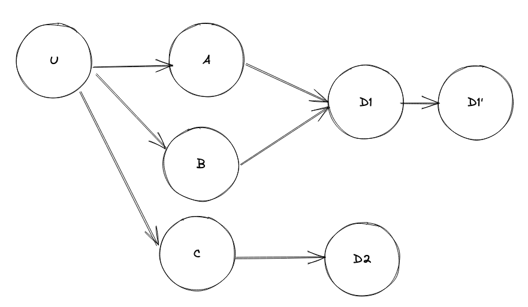

# Charts Repo Actions Demo

[](https://github.com/helm/charts-repo-actions-demo/actions)

Example project to demo testing and hosting a chart repository with GitHub Pages and Actions.

## Actions

* [@helm/kind-action](https://github.com/helm/kind-action)
* [@helm/chart-testing-action](https://github.com/helm/chart-testing-action)
* [@helm/chart-releaser-action](https://github.com/helm/chart-releaser-action)

## Project Status

`main` supports Helm 3 only, i. e. both `v1` and `v2` [API version](https://helm.sh/docs/topics/charts/#the-apiversion-field) charts are installable.

## Chart Sources

* `charts/example-v1`: Sample chart with API version v1
* `charts/example-v2`: Sample chart with API version v2
* `charts/dependencies-v1`: Simple chart with API version v1 to test dependencies from an external Charts repo
* `charts/dependencies-v2`: Simple chart with API version v2 to test dependencies from an external Charts repo

## How-To

You can automatically test and host your own chart repository with GitHub Pages and Actions by following these steps.

### Steps

The prerequisites listed in the READMEs for [actions](#actions) above _must_ be complete before the steps below, or your charts' initial versions won't be released.

1. Use the `main` branch for all of the below, if you wish to use the Actions workflow files as-is
1. Copy the `.github/workflows` files from this project to yours
1. Add your charts to a parent directory in the project (`/charts` is most straightforward, as it's the default. To change this see [helm/chart-testing > configuration > chart-dirs](https://github.com/helm/chart-testing#configuration))
1. Optional: To list your charts repo publicly on the [Helm Hub](https://hub.helm.sh), see [Helm Hub > How To Add Your Helm Charts](https://github.com/helm/hub#how-to-add-your-helm-charts). Consider also pushing to [CNCF Artifact Hub](https://artifacthub.io/)

### Results

* The [Lint and Test Charts](/.github/workflows/lint-test.yaml) workflow uses [@helm/kind-action](https://www.github.com/helm/kind-action) GitHub Action to spin up a [kind](https://kind.sigs.k8s.io/) Kubernetes cluster, and [@helm/chart-testing-action](https://www.github.com/helm/chart-testing-action) to lint and test your charts on every Pull Request and push
* The [Release Charts](/.github/workflows/release.yaml) workflow uses [@helm/chart-releaser-action](https://www.github.com/helm/chart-releaser-action) to turn your GitHub project into a self-hosted Helm chart repo. It does this – during every push to `main` – by checking each chart in your project, and whenever there's a new chart version, creates a corresponding [GitHub release](https://help.github.com/en/github/administering-a-repository/about-releases) named for the chart version, adds Helm chart artifacts to the release, and creates or updates an `index.yaml` file with metadata about those releases, which is then hosted on GitHub Pages
* You should now be able to add your charts repo with `helm repo add <owner> https://<owner>.github.io/<project>`


## Umbrella Helm chart Flat Structure

Tags: In Progress

RFC: [https://docs.google.com/document/d/1FSVX0KSl_p5yfj9rkELIkTmLf6j-931ySaTfKBYyxr8/edit](https://docs.google.com/document/d/1FSVX0KSl_p5yfj9rkELIkTmLf6j-931ySaTfKBYyxr8/edit)

Flat structure for dependencies:

- U → A
- U → B
- A → D
- B → D

### Scenarios

1. Install A and B with only 1 instance of D
2. Install U, with D as an external dependency (outside cluster), where A and B params are configured to use external D
3. Install A on its own with D
4. Install A on its own without D


### How to test?

- Create 1 umbrella placeholder chart
- Create 3 subcharts as dependencies

### Notes

- `{{ .Chart.Name }}` of dependency chart IS `dependency`
- Updating of dependencies is recursive, ie if there are changes to A, running `helm dependency update U` should update `A` . IMPT:  Call `helm dependency update U` whenever there are changes made to its dependencies!
- For A → D B → D scenario, how many D’s get installed?
    - from dry-run, each resource gets created twice, but when installing, error occurs as resources from the same chart will most likely share the same name -
    
    ```bash
    Error: INSTALLATION FAILED: secrets "umbrella-test-merlin-postgresql" already exists
    ```
    
    So, for A and B to share D, D needs to be declared as a separate dependency in the U’s `chart.yaml`
    
- How to overwrite dependency `values.yaml`?
    - Use subchart feature in helm (works for tar files in `charts/` as well)
        
        ```yaml
        ---
        tags:
          test-tag: false
        
        component-a:  # subchart name from Chart.yaml
          containerPort: 5000  # overwrite component-a's containerPort value
          postgresql:
            enabled: false
            database-prime:  # to overwrite database-prime (D -> D') enabled condition
              enabled: false
        component-b:  # subchart name from Chart.yaml
          containerPort: 8080
          postgresql:
            enabled: false
        
        postgresql:  # dependency name
          enabled: true
        ```
        
        where
        
        ```yaml
        # U/Chart.yaml
        ---
        apiVersion: v2
        name: umbrella
        version: "0.0.1"
        dependencies:
          - name: component-a
            version: 0.0.1
            repository: "file://../A"
          - name: component-b
            version: 0.0.1
            repository: "file://../B"
          - name: database
            version: 0.0.1
            repository: "file://../D"
            tags:
              - test-tag
            condition: postgresql.enabled
            alias: postgresql
        
        # A/Chart.yaml
        ---
        apiVersion: v2
        name: component-a
        version: "0.0.1"
        dependencies:
          - name: database
            version: 0.0.1
            repository: "file://../D"
            condition: postgresql.enabled
            alias: postgresql
            tags:
              - test-tag
        
        # B/Chart.yaml
        ---
        apiVersion: v2
        name: component-b
        version: "0.0.1"
        dependencies:
          - name: database
            version: 0.0.1
            repository: "file://../D"
            condition: postgresql.enabled
            alias: postgresql
            tags:
              - test-tag
        ```
        
- Do subchart dependencies need to have an alias? (optional)
    - No, as the condition for the subchart in U’s `values.yaml` is declared in the subchart’s (component-a) block, ie
        
        ```yaml
        # U/values.yaml
        component-a: # chart name
          postgresql:
            enabled: false
        
        # component-a/Chart.yaml
        ---
        apiVersion: v2
        name: component-a
        version: "0.0.1"
        dependencies:---
        apiVersion: v2
        name: umbrella
        version: "0.0.1"
        dependencies:
          - name: component-a
            version: 0.0.1
            repository: "file://../A"
          - name: component-b
            version: 0.0.1
            repository: "file://../B"
          - name: database
            version: 0.0.1
            repository: "file://../D"
            tags:
              - test-tag
            condition: postgresql.enabled
            alias: postgresql
          - name: postgresql
            repository: "@stable"
            version: 7.0.0
            condition: postgresql.enabled
        
        # component-a/values.yaml
        postgresql:
          enabled: true
        
        ```
        
- tags propagate across all dependencies. ie D can be toggled on and off using a single tag in `U/values.yaml`
- What about D’ ? (U → A → D → D’)
    - The following structure will disable `database-prime` dependency
        
        ```yaml
        # A/values.yaml
        containerPort: 8080
        
        postgresql:
          enabled: true
        
          database-prime:
            enabled: true
        
        # U/values.yaml
        component-a: # chart name
          containerPort: 5000 # overwrite component-a's containerPort value
          postgresql:
            enabled: true
            database-prime: # overwrite database-prime enabled condition
              enabled: false
        ```
        
- Behaviour when condition and tags are used at the same time
    - condition will override tag (according to helm [docs](https://helm.sh/docs/topics/charts/#tags-and-condition-fields-in-dependencies))

### Conclusion

To achieve use cases described [here](#scenarios)

- Each dependency (D) must have an associated condition in the form of `(dependency-name).enabled`
    - Each chart’s `values.yaml` should have its dependencies enabled by default
    - Exclusion of dependency needs to come from parent chart’s `values.yaml`
- `U/values.yaml` must have a block for each dependency in Chart.yaml. Whether a dependency should be included in U/Chart.yaml is described below. 
- Subchart’s that contribute to 1 feature should share a tag

- Which dependencies should go into U’s `chart.yaml` ?
    
    
    
    - A and B, C are direct dependencies of U, so they are declared in U’s `chart.yaml`
    - D1 is a shared dependency between A and B, so it should also be declared in U’s `chart.yaml` to meet scenario 1
    - D1’ need not be declared as if D1 is disabled, D1’ is also disabled
    - D2 need not be declared as disabling C will disable D2
    - General: Any node that has more than 1 incoming edge + 1st level nodes will need to be declared as dependencies in `chart.yaml`
